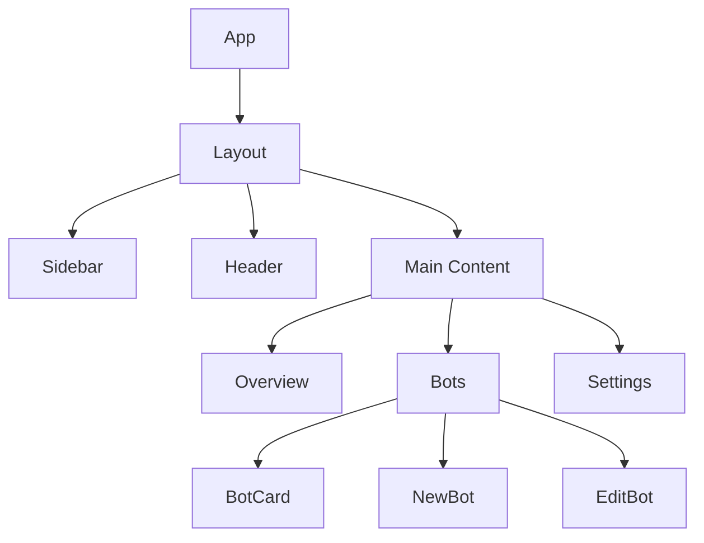
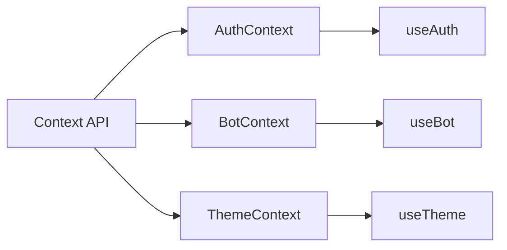
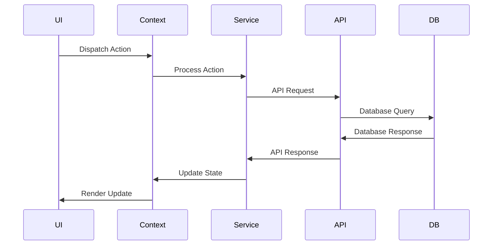

# TradingBot Architecture

## Overview

TradingBot is a full-stack application for cryptocurrency trading automation, built with the following technologies:

- **Frontend**: React + TypeScript
- **Backend**: Node.js + Express
- **Database**: Supabase
- **Authentication**: Supabase Auth
- **Communication**: WebSocket + REST API
- **Monitoring**: Sentry + Grafana

## Project Structure

```
tradingbot/
├── src/
│   ├── components/         # Reusable React components
│   ├── pages/             # Application pages
│   ├── lib/               # Libraries and utilities
│   ├── services/          # Integration services
│   ├── hooks/             # React custom hooks
│   ├── contexts/          # React contexts
│   ├── styles/            # Styles and themes
│   └── types/             # TypeScript type definitions
├── public/               # Static files
├── tests/               # Automated tests
├── docs/                # Documentation
└── scripts/             # Utility scripts
```

## Componentes Principais

### 1. Interface do Usuário


### 2. Gerenciamento de Estado


### 3. Fluxo de Dados


## System Modules

### 1. Authentication
- Supabase Auth for user management
- JWT for API authentication
- Authentication middleware for protected routes
- Automatic token refresh

### 2. Bot Management
- Bot CRUD operations
- Configuration validation
- Status monitoring
- Operation logs

### 3. Exchange Integration
- Exchange API connections
- Credential management
- Order execution
- Balance monitoring

### 4. Webhook System

O sistema de webhooks permite a integração com plataformas de trading como TradingView através de requisições HTTP POST.

#### Configuração
```typescript
interface WebhookConfig {
  enabled: boolean;
  url: string;
  secretKey: string;
  allowedIPs: string[];
  maxOrdersPerMinute: number;
}
```

#### Formato das Requisições

##### Compra
```json
{
  "action": "buy",
  "ticker": "BTCUSDT",
  "order_size": "100%",
  "position_size": 1,
  "schema": "2",
  "timestamp": "2024-02-16T21:17:54.995Z",
  "public_id": "YOUR_BOT_PUBLIC_ID"
}
```

##### Venda
```json
{
  "action": "sell",
  "ticker": "BTCUSDT",
  "order_size": "100%",
  "position_size": 0,
  "schema": "2",
  "timestamp": "2024-02-16T21:17:54.995Z",
  "public_id": "YOUR_BOT_PUBLIC_ID"
}
```

#### Campos
| Campo | Tipo | Descrição |
|-------|------|-----------|
| action | string | "buy" ou "sell" |
| ticker | string | Par de trading (ex: BTCUSDT) |
| order_size | string | Tamanho da ordem em porcentagem |
| position_size | number | 1 para compra, 0 para venda |
| schema | string | Versão do schema (atual: "2") |
| timestamp | string | Timestamp ISO 8601 |
| public_id | string | ID público do bot |

#### Segurança
- Validação de IP através de whitelist
- Autenticação via Secret Key
- Rate limiting por IP
- Validação de timestamp (máximo 5 minutos)
- Validação de schema e payload
- Normalização de IPs (suporte IPv4 e IPv6)

#### Processamento
- Validação assíncrona de requisições
- Fila de processamento de ordens
- Logs detalhados de execução
- Retry automático em caso de falha
- Notificações de erro
- Métricas de performance

#### Integração TradingView
1. Configuração no Strategy Tester
2. Ativação de Webhook URL
3. Configuração do payload JSON
4. Definição do tamanho da posição
5. Configuração de alertas

### 5. Monitoring and Logs
- Structured logs with levels (INFO, WARN, ERROR)
- Request tracking
- Performance metrics
- Authentication logs
- Webhook logs
- Order execution logs
- Real-time status dashboard

## Cache and Storage

### 1. Cache System
```typescript
interface CacheConfig {
  defaultTTL: number;
  provider: 'memory' | 'redis';
  options?: {
    host?: string;
    port?: number;
    password?: string;
  };
}
```

- Memory cache for development
- Redis support for production
- Configurable TTL by data type
- User session caching
- Bot configuration caching
- Exchange data caching
- Automatic invalidation

### 2. Data Persistence
- Supabase as main database
- Automatic migrations
- Incremental backup
- Data replication
- Optimized indexes
- Connection pooling
- ACID transactions

### 3. Memory Storage
```typescript
interface ServerStorage {
  bots: Map<string, Bot>;
  logs: Map<string, SystemLog[]>;
  metrics: Map<string, MetricData>;
  sessions: Map<string, SessionData>;
}
```

- In-memory state management
- Database synchronization
- Automatic old data cleanup
- Periodic disk backup
- Failure recovery
- Real-time metrics

## Exchange Integration

### 1. Configuration
```typescript
interface ExchangeConfig {
  name: string;
  enabled: boolean;
  credentials: {
    apiKey: string;
    secretKey: string;
    passphrase?: string;
  };
  options: {
    testnet: boolean;
    timeout: number;
    rateLimit: number;
  };
}
```

### 2. Features
- Multiple exchange support
- Credential management
- Exchange-specific rate limiting
- Automatic retry
- Data normalization
- Order validation
- Balance monitoring
- Operation logs

### 3. Websocket
- Real-time connection
- Automatic reconnection
- Heartbeat
- Data compression
- Message buffering
- Data validation
- Latency metrics

## Security

### 1. Authentication
```typescript
interface TokenPayload {
  id: string;
  email: string;
  name: string;
  plan: string;
  exp: number;
}
```

- JWT with configurable secret key
- Token validation for all requests
- Automatic token refresh
- Active session verification
- Multiple user plan support
- Secure session persistence
- Automatic logout on token expiration
- Token format validation

### 2. Data Protection
- Credential encryption
- Input sanitization
- Data validation
- XSS protection
- IP-based rate limiting
- IP whitelist validation
- Security headers via Helmet
- Configurable CORS

### 3. Rate Limiting
```typescript
const rateLimitConfig = {
  windowMs: 60 * 1000, // 1 minuto
  max: 60, // limite por IP
  message: 'Muitas requisições deste IP, tente novamente em 1 minuto'
};
```

## Scalability

### 1. Horizontal
- Load balancing
- Multiple instances
- Distributed cache
- Message queues

### 2. Vertical
- Resource optimization
- Connection pooling
- Memory caching
- Data compression

## Monitoring

### 1. Metrics
```typescript
interface SystemMetrics {
  performance: {
    cpu: number;
    memory: number;
    latency: number;
  };
  trading: {
    ordersPerMinute: number;
    successRate: number;
    errorRate: number;
    webhookSuccess: number;
    webhookError: number;
  };
  users: {
    active: number;
    total: number;
    newToday: number;
    sessionsActive: number;
  };
}
```

### 2. Logs
```typescript
interface SystemLog {
  timestamp: Date;
  level: "INFO" | "WARN" | "ERROR";
  module: string;
  message: string;
  details: any;
  userId?: string;
  botId?: string;
  clientIp?: string;
  payload?: any;
}
```

## Deployment

### 1. Development Environment
```bash
# Instalação de dependências
npm install

# Configuração do ambiente
cp .env.example .env
npm run setup

# Desenvolvimento
npm run dev

# Testes
npm run test:unit     # testes unitários
npm run test:e2e      # testes end-to-end
npm run test:coverage # cobertura de testes

# Build
npm run build
npm run typecheck
```

### 2. Production Environment
```bash
# Build da imagem Docker
docker build -t tradingbot:latest .

# Execução com Docker Compose
docker-compose up -d

# Verificação de logs
docker-compose logs -f

# Monitoramento
docker-compose exec app pm2 monit
docker-compose exec app pm2 logs

# Backup
docker-compose exec db pg_dump -U postgres > backup.sql
```

### 3. CI/CD
- GitHub Actions for CI
- Automated testing
- Code analysis
- Image building
- Automatic deployment
- Status notifications
- Automatic rollback

## Configuration

### 1. Environment Variables
```env
# App
NODE_ENV=production
PORT=3001
API_URL=https://api.tradingbot.com
FRONTEND_URL=https://tradingbot.com

# Database
SUPABASE_URL=https://your-project.supabase.co
SUPABASE_KEY=your-anon-key
SUPABASE_SERVICE_KEY=your-service-key

# Security
JWT_SECRET=your-jwt-secret
ENCRYPTION_KEY=your-encryption-key
WEBHOOK_SECRET=your-webhook-secret

# Cache
CACHE_PROVIDER=redis
CACHE_TTL=300
REDIS_URL=redis://redis:6379

# Monitoring
SENTRY_DSN=your-sentry-dsn
GRAFANA_API_KEY=your-grafana-key
LOG_LEVEL=info

# Email
SMTP_HOST=smtp.provider.com
SMTP_PORT=587
SMTP_USER=your-smtp-user
SMTP_PASS=your-smtp-pass
```

### 2. Service Configuration
```typescript
interface ServiceConfig {
  database: {
    url: string;
    maxConnections: number;
    idleTimeoutMillis: number;
    connectionTimeoutMillis: number;
  };
  cache: {
    provider: string;
    ttl: number;
    options: Record<string, any>;
  };
  email: {
    from: string;
    transport: SMTPTransport;
    templates: Record<string, string>;
  };
  monitoring: {
    sentry: {
      dsn: string;
      environment: string;
      tracesSampleRate: number;
    };
    grafana: {
      url: string;
      apiKey: string;
      dashboard: string;
    };
  };
}
```

### 3. Log Configuration
```typescript
interface LogConfig {
  level: 'debug' | 'info' | 'warn' | 'error';
  format: 'json' | 'pretty';
  destination: 'console' | 'file' | 'service';
  rotation: {
    size: string;
    interval: string;
    maxFiles: number;
  };
  fields: {
    timestamp: boolean;
    level: boolean;
    message: boolean;
    [key: string]: boolean;
  };
}
```

## Internationalization (i18n)

### 1. Supported Languages
```typescript
type Language = 'pt-BR' | 'en';

export const translations = {
  'pt-BR': ptBR, // Idioma principal/padrão
  'en': en       // Tradução secundária
};
```

### 2. Translation Structure
```typescript
interface Translation {
  common: {
    save: string;
    cancel: string;
    back: string;
    // ... outros textos comuns
  };
  auth: {
    signIn: string;
    email: string;
    password: string;
    // ... textos de autenticação
  };
  dashboard: {
    title: string;
    overview: string;
    // ... textos do dashboard
  };
  // ... outras seções
}
```

### 3. Language Management
- Portuguese (PT-BR) as primary/default language
- English (EN-US) as secondary language
- React context for language management
- User preference persistence
- Language selector in interface
- Flag emoji support (🇧🇷 PT-BR and 🇺🇸 EN-US)

### 4. Implementation
```typescript
// Contexto de idioma
const LanguageContext = createContext<LanguageContextType>({
  currentLanguage: 'pt-BR',
  setLanguage: () => {},
  t: translations['pt-BR']
});

// Provider de idioma
export function LanguageProvider({ children }: { children: React.ReactNode }) {
  const [currentLanguage, setCurrentLanguage] = useState<Language>('pt-BR');

  const value = {
    t: translations[currentLanguage],
    currentLanguage,
    setLanguage: setCurrentLanguage
  };

  return (
    <LanguageContext.Provider value={value}>
      {children}
    </LanguageContext.Provider>
  );
}
```

### 5. Interface Usage
```typescript
// Componente com suporte a múltiplos idiomas
export function MyComponent() {
  const { t, currentLanguage } = useLanguage();

  return (
    <div>
      <h1>{t.dashboard.title}</h1>
      <p>{t.dashboard.overview}</p>
      <span>
        {currentLanguage === 'en' ? '🇺🇸 EN-US' : '🇧🇷 PT-BR'}
      </span>
    </div>
  );
}
```

### 6. Documentation
- Main documentation in Portuguese
- Source code commented in Portuguese
- Commit messages in Portuguese
- Issues and pull requests in Portuguese
- Bilingual logs and error messages

## Maintenance

### 1. Backup
- Daily database backup
- Code versioning
- Historical logs
- Environment configurations

### 2. Updates
- Security updates
- Bug patches
- New features
- Database migrations

## Next Steps

1. **Technical Improvements**
   - Performance optimization
   - Security enhancements
   - Test expansion
   - Additional documentation

2. **New Features**
   - Support for more exchanges
   - Advanced strategies
   - Mobile interface
   - Performance analysis

3. **Scalability**
   - Distributed infrastructure
   - Global cache
   - Load balancing
   - Resource optimization

# Arquitetura do TradingBot

## 1. Estrutura de Diretórios

```
src/
├── api/              # Endpoints da API
├── components/       # Componentes React
├── lib/             # Bibliotecas e utilitários
│   ├── exchanges/   # Integrações com exchanges
│   ├── i18n/        # Internacionalização
│   ├── theme/       # Configuração de tema
│   └── types/       # Tipos TypeScript
├── hooks/           # Hooks personalizados
├── pages/           # Páginas da aplicação
└── styles/          # Estilos globais
```

## 2. Fluxo de Dados

### Autenticação
1. Login via Supabase
2. Geração de JWT
3. Armazenamento em localStorage
4. Refresh automático
5. Logout e limpeza

### Gerenciamento de Bots
1. Criação
   - Validação de inputs
   - Verificação de limites
   - Geração de IDs únicos
   - Persistência no banco

2. Atualização
   - Validação de mudanças
   - Verificação de estado
   - Atualização parcial
   - Logs de alterações

3. Monitoramento
   - Polling de status
   - Websocket (quando implementado)
   - Cache de dados
   - Atualização de UI

## 3. Integrações

### MEXC Exchange
- API REST
- Autenticação via API Key
- Rate limiting
- Websocket feed

### Supabase
- Autenticação
- Banco de dados
- Storage
- Realtime

## 4. Estado Global

### Contextos
- Autenticação
- Tema
- Idioma
- Configurações

### Cache Local
- Pares de trading
- Ícones de tokens
- Dados de usuário
- Configurações

## 5. Segurança

### API Keys
- Armazenamento seguro
- Mascaramento na UI
- Validação periódica
- Rotação automática

### Webhooks
- Validação de origem
- Rate limiting
- Logs de acesso
- Retry mechanism

## 6. Performance

### Otimizações
- Code splitting
- Lazy loading
- Memoização
- Cache strategies

### Monitoramento
- Logs de erro
- Métricas de uso
- Tempo de resposta
- Taxa de sucesso

## 7. Responsividade

### Breakpoints
```typescript
const breakpoints = {
  sm: '640px',
  md: '768px',
  lg: '1024px',
  xl: '1280px',
  '2xl': '1400px'
}
```

### Adaptações
- Layout flexível
- Navegação adaptativa
- Imagens responsivas
- Touch friendly

## 8. Temas

### Variáveis CSS
```css
:root {
  --background: 0 0% 100%;
  --foreground: 222.2 84% 4.9%;
  --card: 0 0% 100%;
  --card-foreground: 222.2 84% 4.9%;
  --popover: 0 0% 100%;
  --popover-foreground: 222.2 84% 4.9%;
  --primary: 221.2 83.2% 53.3%;
  --primary-foreground: 210 40% 98%;
  --secondary: 210 40% 96.1%;
  --secondary-foreground: 222.2 47.4% 11.2%;
  --muted: 210 40% 96.1%;
  --muted-foreground: 215.4 16.3% 46.9%;
  --accent: 210 40% 96.1%;
  --accent-foreground: 222.2 47.4% 11.2%;
  --destructive: 0 84.2% 60.2%;
  --destructive-foreground: 210 40% 98%;
  --border: 214.3 31.8% 91.4%;
  --input: 214.3 31.8% 91.4%;
  --ring: 221.2 83.2% 53.3%;
  --radius: 0.5rem;
}

.dark {
  --background: 222.2 84% 4.9%;
  --foreground: 210 40% 98%;
  /* ... outras variáveis do tema escuro ... */
}
```

## 9. Internacionalização

### Estrutura
```typescript
const translations = {
  'pt-BR': {
    common: {
      save: 'Salvar',
      cancel: 'Cancelar',
      // ...
    },
    bots: {
      create: 'Criar Bot',
      edit: 'Editar Bot',
      // ...
    }
  },
  'en': {
    // ... traduções em inglês
  }
}
```

### Formatação
- Números
- Datas
- Moedas
- Porcentagens

## 10. Websockets (Planejado)

### Eventos
- Atualizações de preço
- Status do bot
- Execuções de ordem
- Notificações

### Reconexão
- Exponential backoff
- Keep-alive
- Estado de conexão
- Buffering 